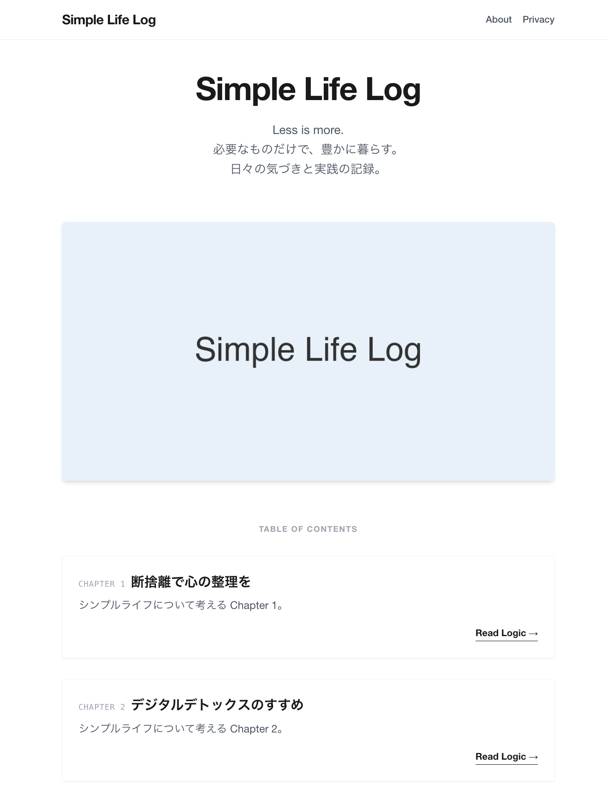

# Simple Life Log – Astro Blog Template

シンプルなAstro製ブログテンプレート（CMSなし）です。Markdownで記事を書き、静的サイトとして配布・運用できます。

デモ: https://simplelife-log.pages.dev/



## 特徴
- Astro + Tailwind CSS
- 画像付きヒーローとシンプルな目次トップ
- 記事ページにJSON-LD（BlogPosting）とOG/Twitterメタ
- Sitemap/robots.txt 対応

## 使い方

### 1) 依存関係のインストール
```bash
npm install
```

### 2) 開発サーバー起動
```bash
npm run dev
```

### 3) ビルド
```bash
npm run build
```

### 4) プレビュー
```bash
npm run preview
```

## 記事の追加
`src/content/posts/` に Markdown を追加します。Frontmatter は以下の通りです。

CMSなし運用のため、このフォルダにMarkdownを追加してビルドすれば自動で記事が増えます。

```yaml
---
title: "記事タイトル"
description: "記事の概要"
pubDate: "2025-01-01"
updatedDate: "2025-01-10" # 任意
heroImage: "/images/hero.png" # 任意
order: 1
---
```

- `order` は目次での並び順に使われます。
- `heroImage` はOG画像にも使用されます。

## カスタマイズポイント

### サイト名 / 説明文
- `src/components/Head.astro` の `Simple Life Log` と `description` を変更してください。
- ページタイトルは `Layout` が `"{title} | サイト名"` 形式で出力します。

### サイトURL
- `astro.config.mjs` の `site` を本番URLに変更してください。
  - Canonical / OG / Sitemap に使われます。

### 画像サイズ（CLS対策）
- `src/pages/index.astro` のヒーロー画像に `width` / `height` を設定しています。
- 画像を差し替える場合は実サイズに合わせて更新してください。

## デプロイ
- Cloudflare Pages などの静的ホスティングにそのままデプロイできます。

## ライセンス
MIT License
